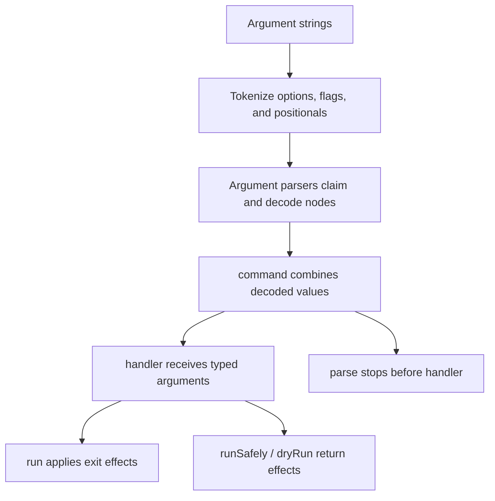

# Parsers and runners

> Understand where input is claimed, decoded, composed, and executed before
> choosing an API or parser order.

cmd-ts separates describing input from applying command behavior. The same
command definition can therefore power a process entrypoint, a test, or an
embedded call.



## Argument parsers claim input

`option`, `flag`, `positional`, and their repeatable variants each claim nodes
from one shared parse context. A claimed node cannot be consumed again.

The property order of `command({ args })` is therefore meaningful for
positional and catch-all parsers. Named options and flags are located by their
registered keys, but positional parsers take the next unclaimed positional.
`restPositionals` and `rest` should come last.

## Commands compose values

`command` parses every entry in `args` and creates an object with the same keys.
Only after all input succeeds does it call the handler:

```ts
const app = command({
  name: 'greet',
  args: {
    name: positional(),
    loud: flag({ long: 'loud' }),
  },
  handler({ name, loud }) {
    return loud ? name.toUpperCase() : name;
  },
});
```

The parser output is `{ name: string; loud: boolean }`; the handler result is a
`string`. Runner APIs preserve that handler result on success.

## Subcommands select a command

`subcommands` first decodes the command name, then delegates the remaining
context to that command. Nested groups repeat this process and extend the help
path at each level.

## Binary adapts Node arguments

Node supplies the executable and script paths before user arguments.
`binary(command)` adapts this full array and preserves the command name used in
help and errors:

```ts
await run(binary(app), process.argv);
```

Do not wrap commands passed argument-only arrays in tests. See
[Test and embed commands](../guides/test-and-embed.md).
