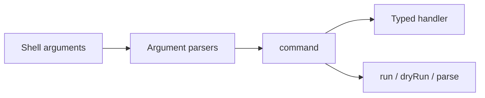

# cmd-ts

> Build Node.js command-line interfaces whose runtime validation and TypeScript
> handler types come from the same argument definitions.

`@alloc/cmd-ts` composes small argument parsers into commands and subcommands.
Each parser decodes shell input before the command handler runs, so a handler
receives typed values instead of unchecked strings.

```ts
import { command, number, option, run } from '@alloc/cmd-ts';

const app = command({
  name: 'deploy',
  args: {
    replicas: option({ long: 'replicas', short: 'r', type: number }),
  },
  handler({ replicas }) {
    console.log(`Deploying ${replicas} replicas`);
  },
});

await run(app, ['--replicas', '3']);
```

The handler sees `replicas` as a `number`. If a user supplies `three`, cmd-ts
reports the decoding error before calling the handler.

## Choose a starting point

| Goal | Start here |
| --- | --- |
| Build a first command | [Getting started](./getting-started.md) |
| Choose an argument parser | [Argument reference](./reference/arguments.md) |
| Make input optional | [Required and optional input](./concepts/required-and-optional-input.md) |
| Validate domain-specific input | [Validate input](./guides/validate-input.md) |
| Build a multi-command program | [Build subcommands](./guides/build-subcommands.md) |
| Test without exiting the process | [Test and embed commands](./guides/test-and-embed.md) |

## How a command fits together

An argument parser claims input and decodes it. `command` combines parsers and
passes their results to a handler. `subcommands` selects among commands, while
`binary` adapts a command to Node's full `process.argv` array.



Read [Parsers and runners](./concepts/parsers-and-runners.md) before choosing
lower-level execution APIs.
